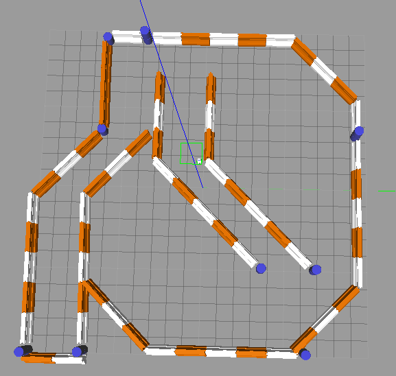

# Udacity Robotics Software Engineer Project
## Term2 Localization Lab

## Abstract
The two robots were created in the project, both robots started from a initial starting point, then utilized ROS packages to accurately localize a mobile robot inside a provided map in the Gazebo and RViz simulation environments. The sensors and AMCL (Adaptive Monte Carlo Localization) algorithm were used to locate current position, and search the path to navigate automatically to a predefined target position. The results for both the Classroom robot and the developed robot will be compared in this article.

[image_0]: ./images/new_robot_result-w1.PNG
![alt text][image_0] 

## Introduction
The project forcus on following several aspects of robotics:
* Building a mobile robot for simulated tasks.
* Creating a ROS package that launches a custom robot model in a Gazebo world and utilizes packages like AMCL and the Navigation Stack.
* Exploring, adding, and tuning specific parameters corresponding to each package to achieve the best possible localization results.

The project created two robots: one is benchmark robot (called: udacity_bot) given as part of the project, the second one (called: new_robot) was created by auther.
Both robots need to use sensors such as a camera or Lidar (Light Detection and Ranging) and AMCL algorithm package. 

A predefined maze map was provided, and a C++ navigation goal program was coded to give a navugation goal position. 

## Background
The robot performance is related a running environment directly, it is so important which hardware and virtual machine configuration were used in this project.
### Hardware:
     Computer model: Surface Pro 4
     
     Processor: Intel i7-6650U CPU @ 2.20GHz @2.21GHz
     
     RAM: 16GB
     
     Operation System: Window 10 Pro
     
### Virual Machine:

     VMware Workstation 12 Pro, version 12.5.6
   
     Processor: 2
   
     Memory: 8GB
   
     Hard Disk: 40 GB
   
### Software

1. Using an Udacity ROS (Kinetic) package to create a robot simulation environment on VMWare machine. 
This ROS includes Python (2.7), Gazebo (7.10.0) and RViz (1.12.15) packages.

2. To build a testing simulation environment, these package need to install in ROS:
* ros-kinetic-navigation

* ros-kinetic-map-server

* ros-kinetic-move-base

* ros-kinetic-amcl

3. Using URDF (Unified Robot Description Format) to create the robot model which includes pose, inertial, collision and visual data.  
Two sensors - a camera and a laser rangefinder (Hokuyo) was added in this URDF model.

4. Three Gazebo plugins were used to help utilize all available gazebo functionality in order to implement specific use-cases for specific models. They are:
* A plugin for the camera sensor.

* A plugin for the hokuyo sensor.

* A plugin for controlling the wheel joints.

  A xacro file under urdf folder, udacity_bot.gazebo, includes these three plugins

5. A map created by Clearpath Robotics was used for both robots in the project.

[image_1]: ./images/map.PNG
![alt text][image_1] 

6. AMCL (Adaptive Monte Carlo Localization) algorithm was used to dynamically adjust the number of particles over a period of time.

7. A C++ code - navigation_goal.cpp file was used to send a target position to move_base action server.

8. There launch file: robot_description.launch, udacity_world.launch and amcl.launch under launch folder.

## Results

## Model Configuration

## Discussion

## Future Work

