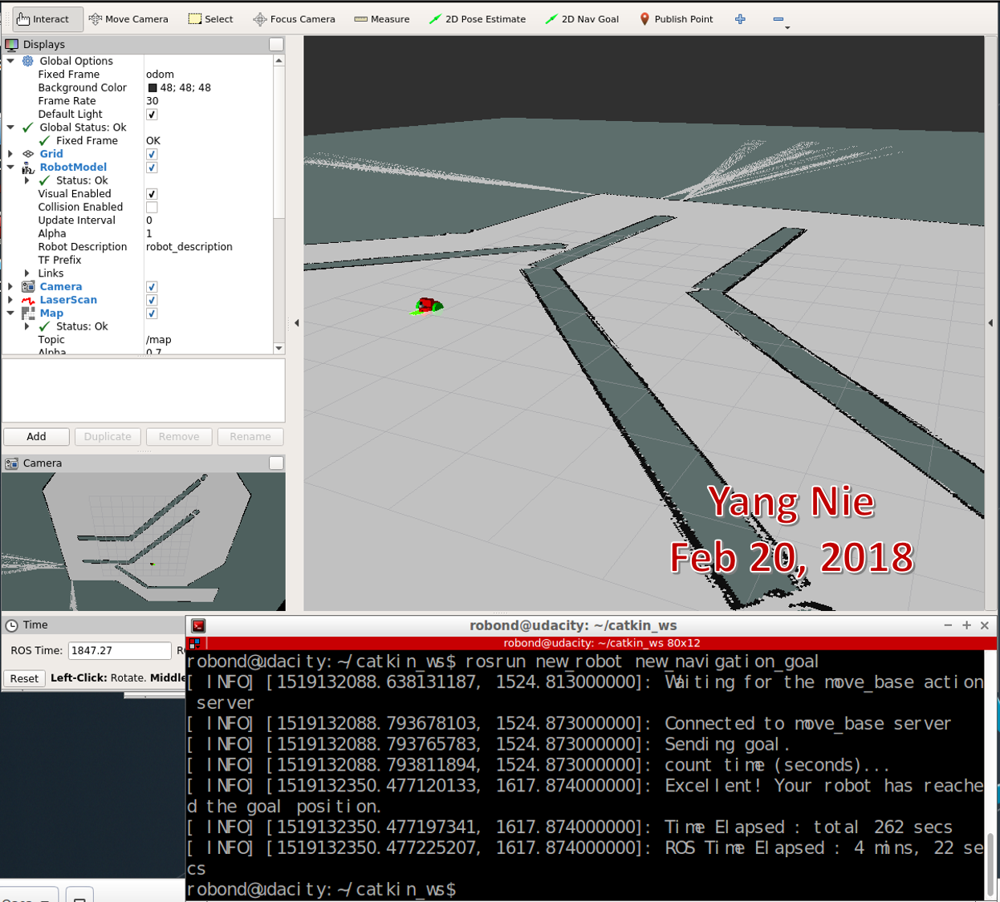
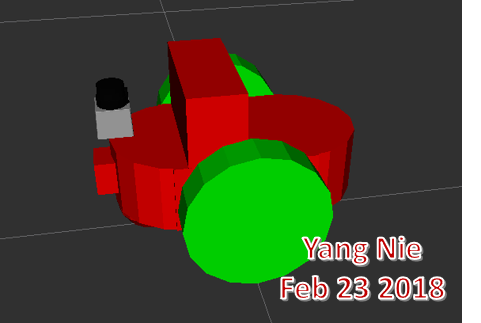
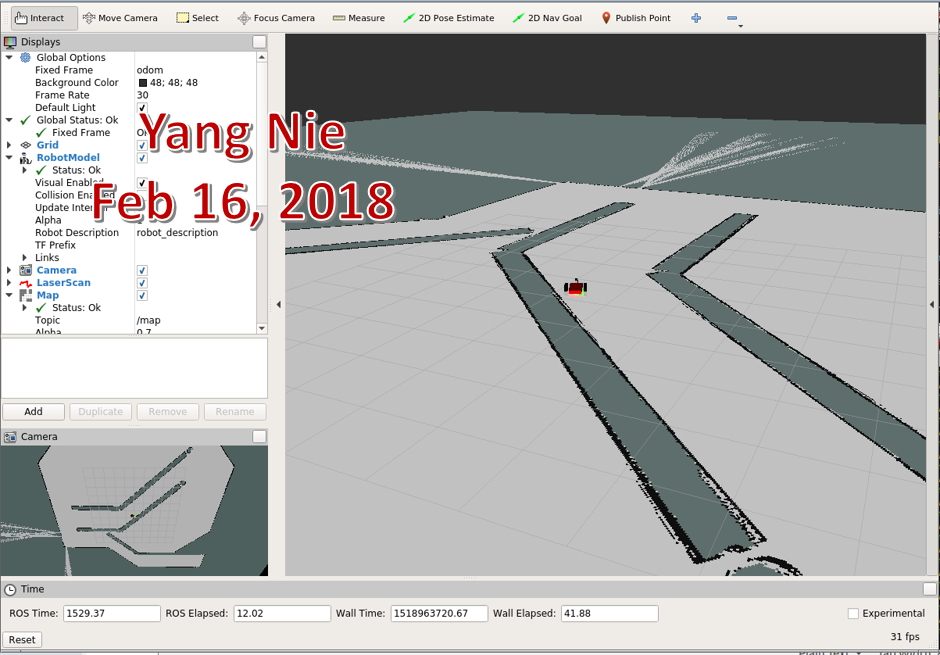
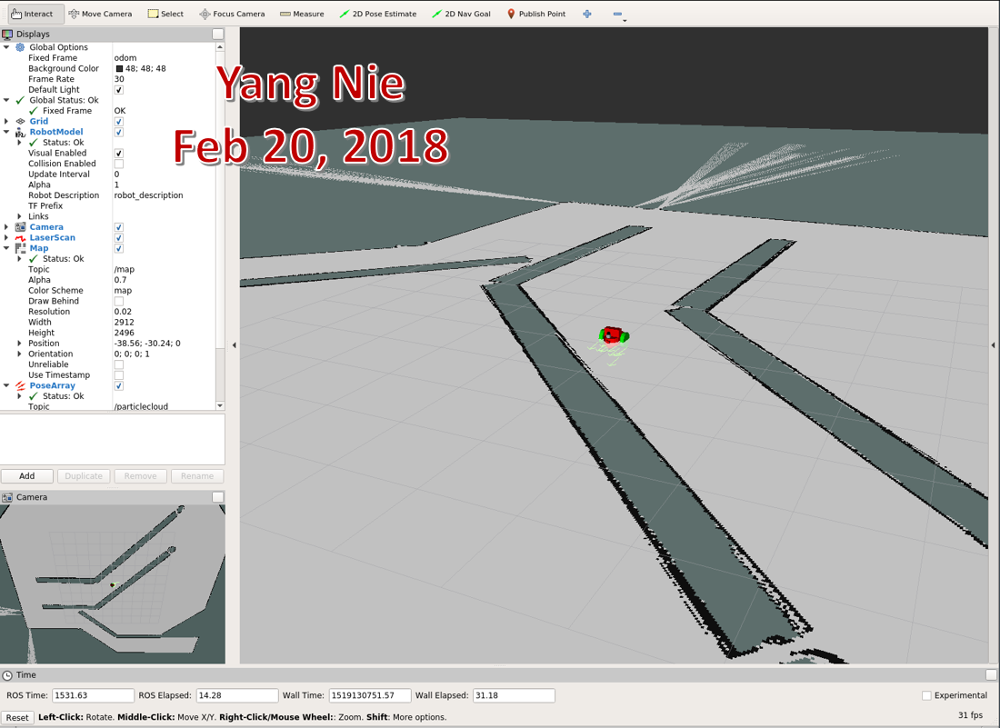
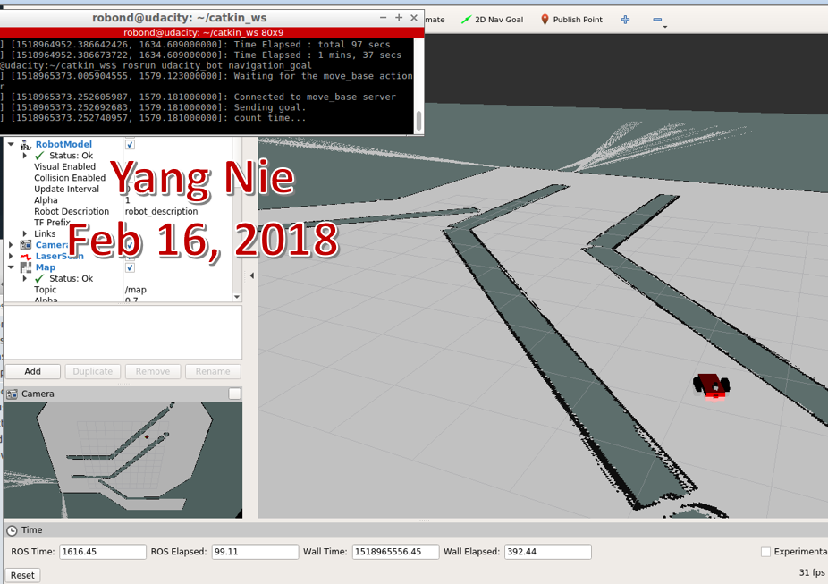
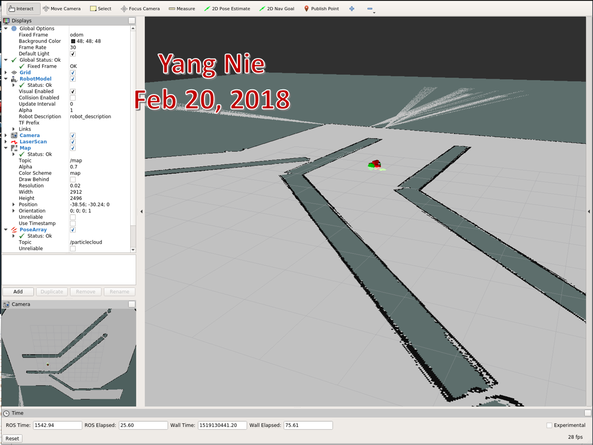
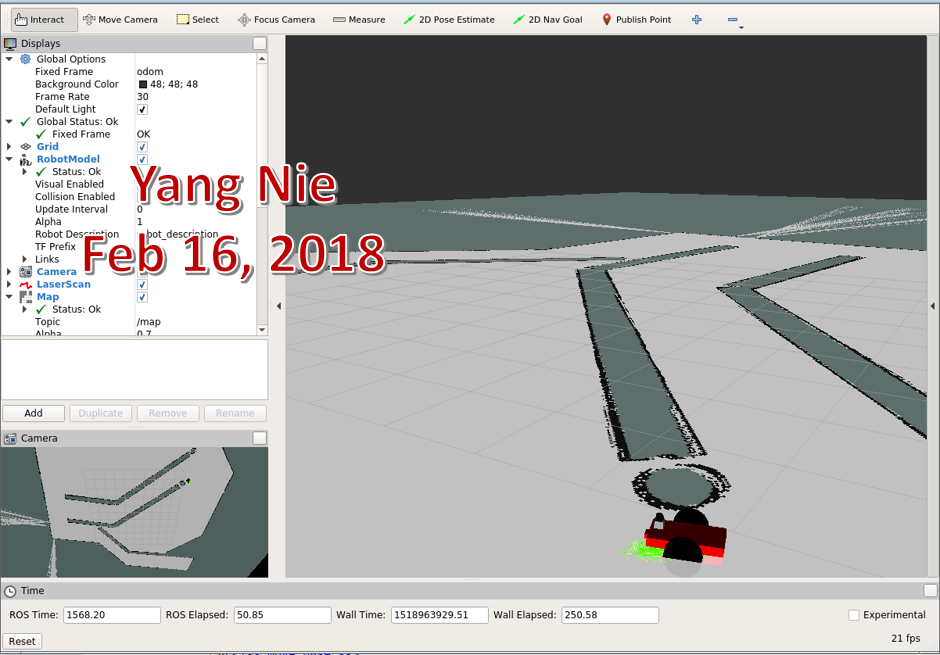
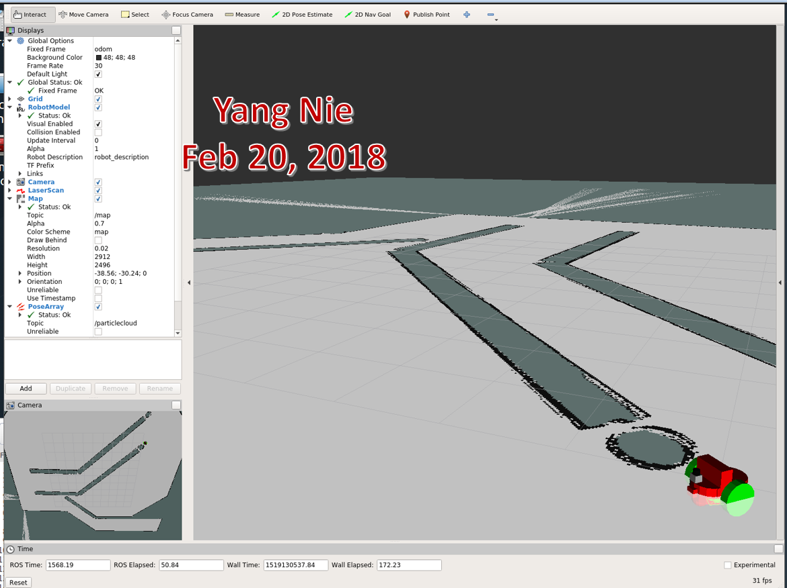
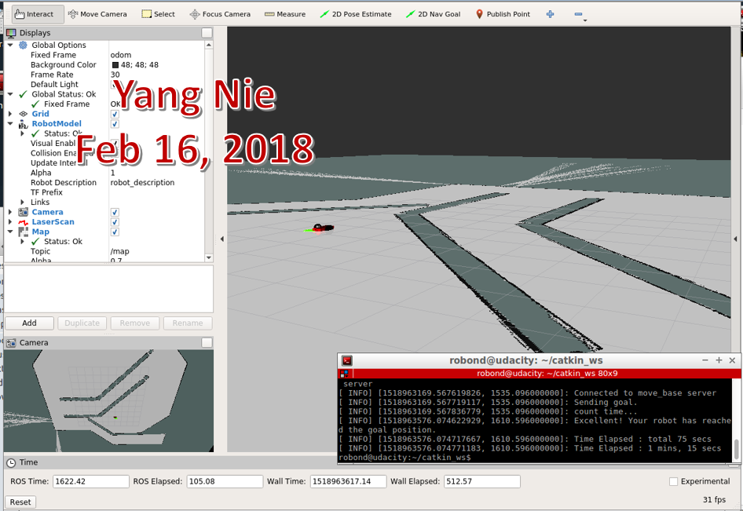
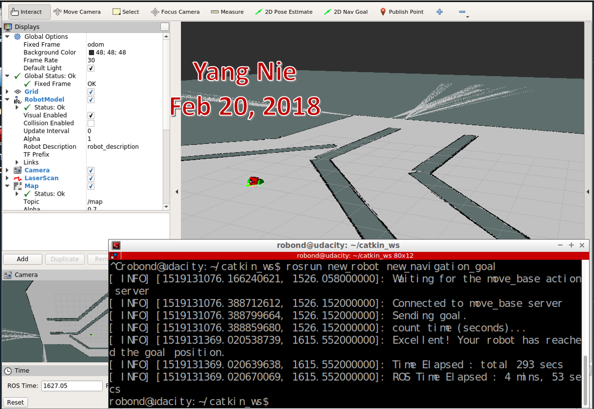

# Udacity Robotics Software Engineer Project
## Term2 Localization Lab

## Abstract
The two robots were created in the project, both robots started from a initial starting point, then utilized ROS packages to accurately localize a mobile robot inside a provided map in the Gazebo and RViz simulation environments. The sensors and AMCL (Adaptive Monte Carlo Localization) algorithm were used to locate current position, and search the path to navigate automatically to a predefined target position. The results for both the Classroom robot and the developed robot will be compared in this article.



## Introduction
The project focuses on the following several aspects of robotics:

* Building a mobile robot for simulated tasks.
* Creating a ROS package that launches a custom robot model in a Gazebo world and utilizes packages like AMCL and the Navigation Stack.
* Exploring, adding, and tuning specific parameters corresponding to each package to achieve the best possible localization results.

### The project created two robots: 
* One is benchmark robot (called: udacity_bot) given as part of the project, 
* The second one (called: new_robot) was created by auther.



Both robots need to use sensors such as a camera or Lidar (Light Detection and Ranging) and AMCL algorithm package. 

A predefined maze map was provided, and a C++ navigation goal program was coded to give a navigation goal position. 

## Background
The robot performance is related a running environment directly, it is so important which hardware and virtual machine configuration were used in this project.
### Hardware:
     Computer model: Surface Pro 4

     Processor: Intel i7-6650U CPU @ 2.20GHz @2.21GHz

     RAM: 16GB

     Operation System: Window 10 Pro

### Virual Machine:

     VMware Workstation 12 Pro, version 12.5.6

     Processor: 2

     Memory: 8GB

     Hard Disk: 40 GB

### Software

1. Using an Udacity ROS (Kinetic) package to create a robot simulation environment on VMWare machine. 
This ROS includes Python (2.7), Gazebo (7.10.0) and RViz (1.12.15) packages.

2. Using URDF (Unified Robot Description Format) to create the robot model which includes pose, inertial, collision and visual data.  
Two sensors - a camera and a laser rangefinder (Hokuyo)[1] was added in this URDF model.

3. A map created by Clearpath Robotics[2]  was used for both robots in the project.


4. AMCL (Adaptive Monte Carlo Localization) algorithm was used to dynamically adjust the number of particles over a period of time.

5. A C++ code  was used to send a target position to move_base action server.

####  Kalman Filters and Monte Carlo Simulations are two most common algorithms for robot localization:
1. Kalman Filters and EKF
  Kalman filters is a algorithm that uses a series of measurements observed over time, containing statistical noise and other inaccuracies, and produces estimates of unknown variables that tend to be more accurate than those based on a single measurement alone, by estimating a joint probability distribution over the variables for each timeframe[3]. 
  EKF (Extend Kalman Filters)  is the nonlinear version of the Kalman filter which linearizes about an estimate of the current mean and covariance. In the case of well defined transition models, the EKF has been considered the de facto standard in the theory of nonlinear state estimation, navigation systems and GPS[4].

  ​

2. Monte Carlo Simulations
  Monte Carlo simulations are used to model the probability of different outcomes in a process that cannot easily be predicted due to the intervention of random variables. It is a technique used to understand the impact of risk and uncertainty in prediction and forecasting models[5].

  ​

3. Compare Monte Carlo Simulations vs. Extend Kalman Filters
|    | MCL | EKF |
| :--- | :---: | :---: |
| Measurements | Raw Measurements | Landmarks |
| Measurement Noise | Any | Guassian |
| Posterior | Particles | Guassian |
| Efficiency(memory) | OK | Good |
| Efficency(time) | OK | Good |
| Ease of implementation | Good | OK |
| Resolution | OK | Good |
| Robustness | Good | OK |
| Memory & Resolution Control | Yes | No |
| Global Localization | Yes | No |
| State Space | Multimodel Discrete | Unimodel Continuous |


## Results
### Testing scenario:
Both robots used the same map with same starting (0 0 -0.785) and target (0.995 -2.99 0) position.

| udacity_bot | new_robot |
| :---: | :---: |
|  |  |

### Testing results
#### Both robots navigated in map very well and could arrive to the target position within reasonable time.
| | udacity_bot | new_robot |
| :---: | :---: | :---: |
| Go straight |  |  |
| Make a turn |  |  |
| Arrived target |  |  |
| Average Time | 6 -7 munites | 4 -5 munites |

## Model Configuration
### The new_robot parameter list as:
```
 * /amcl/base_frame_id: robot_footprint
 * /amcl/controller_frequency: 10.0
 * /amcl/global_frame_id: map
 * /amcl/initial_pose: 0 0 -0.785
 * /amcl/laser_model_type: likelihood_field_...
 * /amcl/max_particles: 240
 * /amcl/min_particles: 30
 * /amcl/odom_alpha1: 0.002
 * /amcl/odom_alpha2: 0.002
 * /amcl/odom_alpha3: 0.001
 * /amcl/odom_alpha4: 0.001
 * /amcl/odom_frame_id: odom
 * /amcl/odom_model_type: diff-corrected
 * /amcl/recovery_alpha_fast: 0.1
 * /amcl/recovery_alpha_slow: 0.01
 * /amcl/resample_interval: 1.0
 * /amcl/transform_tolerance: 3.2
 * /amcl/use_map_topic: True
 * /move_base/TrajectoryPlannerROS/escape_vel: -0.1
 * /move_base/TrajectoryPlannerROS/gdist_scale: 1.0
 * /move_base/TrajectoryPlannerROS/heading_scoring_timestep: 0.8
 * /move_base/TrajectoryPlannerROS/holonomic_robot: False
 * /move_base/TrajectoryPlannerROS/latch_xy_goal_tolerance: False
 * /move_base/TrajectoryPlannerROS/meter_scoring: True
 * /move_base/TrajectoryPlannerROS/oscillation_reset_dist: 0.1
 * /move_base/TrajectoryPlannerROS/pdist_scale: 0.8
 * /move_base/TrajectoryPlannerROS/publish_cost_grid_pc: False
 * /move_base/TrajectoryPlannerROS/sim_time: 3.0
 * /move_base/TrajectoryPlannerROS/xy_goal_tolerance: 0.05
 * /move_base/TrajectoryPlannerROS/yaw_goal_tolerance: 0.05
 * /move_base/base_global_planner: navfn/NavfnROS
 * /move_base/base_local_planner: base_local_planne...
 * /move_base/controller_frequency: 5.0
 * /move_base/global_costmap/global_frame: map
 * /move_base/global_costmap/height: 40.0
 * /move_base/global_costmap/inflation_radius: 0.2
 * /move_base/global_costmap/laser_scan_sensor/clearing: True
 * /move_base/global_costmap/laser_scan_sensor/data_type: LaserScan
 * /move_base/global_costmap/laser_scan_sensor/marking: True
 * /move_base/global_costmap/laser_scan_sensor/sensor_frame: hokuyo
 * /move_base/global_costmap/laser_scan_sensor/topic: /new_robot/laser/...
 * /move_base/global_costmap/map_type: costmap
 * /move_base/global_costmap/observation_sources: laser_scan_sensor
 * /move_base/global_costmap/obstacle_range: 5.0
 * /move_base/global_costmap/publish_frequency: 2.0
 * /move_base/global_costmap/raytrace_range: 9.0
 * /move_base/global_costmap/resolution: 0.05
 * /move_base/global_costmap/robot_base_frame: robot_footprint
 * /move_base/global_costmap/robot_radius: 0.19
 * /move_base/global_costmap/rolling_window: False
 * /move_base/global_costmap/static_map: True
 * /move_base/global_costmap/transform_tolerance: 0.4
 * /move_base/global_costmap/update_frequency: 2.0
 * /move_base/global_costmap/width: 40.0
 * /move_base/local_costmap/global_frame: odom
 * /move_base/local_costmap/height: 20.0
 * /move_base/local_costmap/inflation_radius: 0.2
 * /move_base/local_costmap/laser_scan_sensor/clearing: True
 * /move_base/local_costmap/laser_scan_sensor/data_type: LaserScan
 * /move_base/local_costmap/laser_scan_sensor/marking: True
 * /move_base/local_costmap/laser_scan_sensor/sensor_frame: hokuyo
 * /move_base/local_costmap/laser_scan_sensor/topic: /new_robot/laser/...
 * /move_base/local_costmap/map_type: costmap
 * /move_base/local_costmap/observation_sources: laser_scan_sensor
 * /move_base/local_costmap/obstacle_range: 5.0
 * /move_base/local_costmap/publish_frequency: 2.0
 * /move_base/local_costmap/raytrace_range: 9.0
 * /move_base/local_costmap/resolution: 0.05
 * /move_base/local_costmap/robot_base_frame: robot_footprint
 * /move_base/local_costmap/robot_radius: 0.19
 * /move_base/local_costmap/rolling_window: True
 * /move_base/local_costmap/static_map: False
 * /move_base/local_costmap/transform_tolerance: 0.4
 * /move_base/local_costmap/update_frequency: 2.0
 * /move_base/local_costmap/width: 20.0
 * /rosdistro: kinetic
 * /rosversion: 1.12.12

NODES
  /
    amcl (amcl/amcl)
    map_odom_broadcaster (tf/static_transform_publisher)
    map_server (map_server/map_server)
    move_base (move_base/move_base)

ROS_MASTER_URI=http://localhost:11311
```
#### Several parameters were adjusted in the project and impacted robot performance:
1. /amcl/max_particles: If it is too low, the robot will take more time to navigate, and this error: "Clearing costmap to unstuck robot" pops up.
2. robot_radius: It it is too low, the robot will stuck on the wall without turning. If it is too high, the robot can turn into a cycle.
3. raytrace_range: Set it little higher that can help the robot keeps inside the navigation path to the target.
4. /move_base/controller_frequency: Set the lower value to eliminate the warning message "Control loop missed its desired rate of 20.0000Hz". This parameter doesn't impact robot performance, but it will reduce these unnecessary warning messages on the screen and in the log file.

## Discussion
* Adjusting the parameter is a big challenge and time consuming job. Those parameters can be changed independently, but they are related eachother. It is impossible that one person tries all possible combination values for all parameters in limited time. A team work needs to assign for achieving the best result.
* AMCL would'n work well for the kidnapped robot problem, when this error: "Clearing costmap to unstuck robot" happened, the robot abruptly disappeared from one location and showed up in another position.
* A moving robot with MCL/AMCl algorithm can be used warehouse industry to move and delivery good inside the warehouse. This job and working environment have clear start and end positions. 


## Future Work
* Both robots started forward to dead end direction, then turned back to reverse point. The further study needs to involve to find out this is an algorithm issue or parameter turning problem.
* Additional sensor can be added on back of the robot, so the robot can go back and forth without rotating to navigate to the target position.

* Adjusting and trying different parameters are very man power cost work, a database can be built to store these test and result data to help developing a new robot, and use Deep Learning technology to figure out and generate these parameters automatically.

## Reference
[1] ClearPathRobotics,“Clearpath robotics home page.”https://www.clearpathrobotics.com, 2018.
[2] Hokuyo, “Hokuyo laser scanner home page.” https://www.hokuyo-aut.jp, 2018.
[3] Wikipedia, "Kalman filter" https://en.wikipedia.org/wiki/Kalman_filter 2018
[4] Wikipedia, "Extended Kalman filter" https://en.wikipedia.org/wiki/Extended_Kalman_filter  2018
[5] Investopedia, "Monte Carlo Simulation"  https://www.investopedia.com/terms/m/montecarlosimulation.asp#ixzz57zwEirv5 2018

